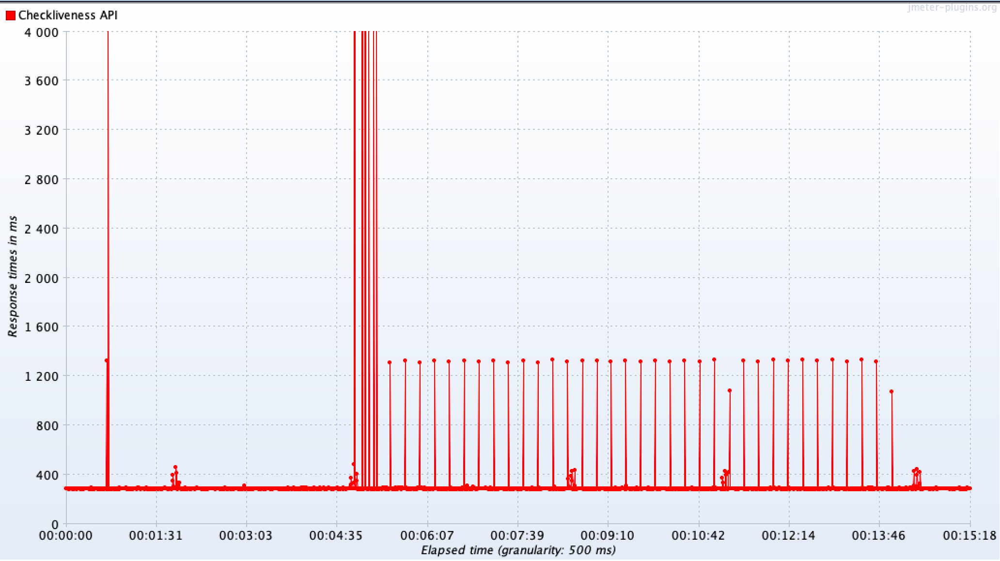
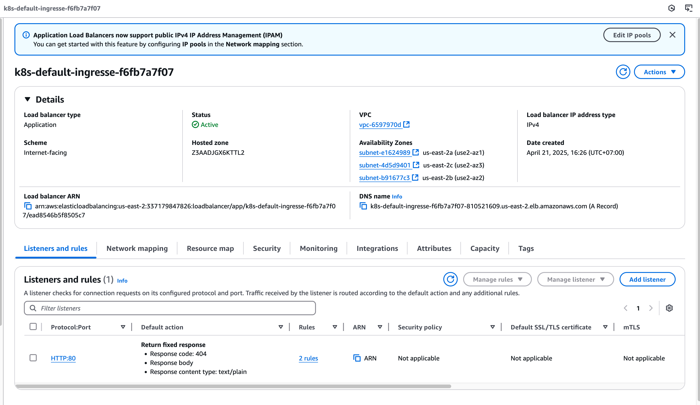

# Get your hands dirty
### Server Orchestration
1. Figure out how to scale the number of instances running the sample app from three to four.
--> Update the sample-app-vars.yml
```
num_instances: 4
base_name: sample_app_instances
http_port: 8080
```
Create the instance
```
ansible-playbook -v create_ec2_instances_playbook.yml --extra-vars "@sample-app-vars.yml"
```
Configure instance again, to apply the configuration to the newly created instance
```
ansible-playbook -v -i inventory.aws_ec2.yml configure_sample_app_playbook.yml
```
Configure nginx again, to add the newly created instance to the load balancing backend
```
ansible-playbook -v -i inventory.aws_ec2.yml configure_nginx_playbook.yml
```
Connect to the instance and check the /etc/nginx.conf and the /var/log/nginx.log, send requests continously to the nginx to ensure all the instances receive load, consider add this line to the config to know which server nginx will forward the request to
```
'upstream: $upstream_addr';
```
2. Try restarting one of the instances using the AWS Console. How does nginx handle it while the instance is rebooting? Does the sample app still work after the reboot?
--> Using JMeter to continuously send the requests at 5TPS, then we reboot 1 isntance, we can see that the client still receive success response (200), checking the log we can see the failover of nginx, the 172.31.1.181 fails, nginx moved to 172.31.14.51. But there is notable increase of response time (which can be seen from jmeter response time chart) from 200ms --> 3s
```
27.72.21.131 - - [18/Apr/2025:11:09:13 +0000] "GET / HTTP/1.1" 200 35 "-" "Apache-HttpClient/4.5.12 (Java/17.0.2)" "-" upstream: 172.31.1.181:8080, 172.31.14.51:8080
27.72.21.131 - - [18/Apr/2025:11:09:13 +0000] "GET / HTTP/1.1" 200 35 "-" "Apache-HttpClient/4.5.12 (Java/17.0.2)" "-" upstream: 172.31.8.62:8080
```
After the sample app restarted, it could serve the request normally, without any interaction from the sysadmin
```
27.72.21.131 - - [18/Apr/2025:11:10:13 +0000] "GET / HTTP/1.1" 200 35 "-" "Apache-HttpClient/4.5.12 (Java/17.0.2)" "-" upstream: 172.31.1.181:8080
```
3. Try terminating one of the instances using the AWS Console. How does nginx handle it? How can you restore the instance?
--> While terminating the instance, the behaviour is similar to rebooting, we see the failover in the log, and similarly, an increase in response time up to 60s, then 3s afterward
```
27.72.21.131 - - [18/Apr/2025:11:12:39 +0000] "GET / HTTP/1.1" 200 35 "-" "Apache-HttpClient/4.5.12 (Java/17.0.2)" "-" upstream: 172.31.1.181:8080, 172.31.14.51:8080
```
To restore the instance, run the playbooks like question 1
```
ansible-playbook -v create_ec2_instances_playbook.yml --extra-vars "@sample-app-vars.yml"
ansible-playbook -v -i inventory.aws_ec2.yml configure_sample_app_playbook.yml
ansible-playbook -v -i inventory.aws_ec2.yml configure_nginx_playbook.yml
```
However the script does not allow you to reload nginx to apply the new config yet so you have to manually do it
```
sudo systemctl reload nginx
```
You will see the new instance got served by nginx, jmeter test result below

### VM Orchestration
1. Having the ASG deploy the latest AMI is convenient for testing and development, but in production, you typically want to be able to specify the exact AMI version to deploy, so you don’t roll out new code unintentionally. Update the Packer template to add an input variable that lets you specify a version number, and include that version number in the AMI name. Now you can set the ami_name input variable in the asg module to the exact AMI you want to deploy.
--> Created file `sample-app-extra.pkr.hcl for this requirement`, in main.tf, update the `ami_name` input
2. Scale the number of instances in the ASG from three to four. How does this compare to the server orchestration example?
--> Changing min instance from 3 to 4
--> With ASG, everything is more automated, faster, less risk (roll-back setting, healthcheck), by running `tofu apply`, comparing to runinng multiple command line to create new instance, configure, and update nginx.
3. Try terminating one of the instances using the AWS Console. How does the ALB handle it? What about the ASG?
--> We got 502 and 504 error codes, the ALB will then notice then unhealthy instance and route the requests to the healthy ones, then no error codes, the ASG will detect then number of instance is fewer than the desired min capacity, it will automatically launch a new replacement (around 1 minute after the instance is terminated), the new instance will be launch fron the same template (AMI, configuration), so it is guaranteed to be the same as the existing instances, once the instance is fully initialized, it will register with the ALB, the ALB will then perform healthcheck, once the health checks pass, the ALB starts routing traffic to the new instance, now traffic is distributed across all available instances.
### Container Orchestration
1. I’m using YAML in these examples to avoid introducing extra tools, but raw YAML is not a great choice for production, as it doesn’t support variables, templating, for-loops, conditionals, and other programming language features that allow for code reuse. In production, you may instead want to try tools such as Helm, OpenTofu with the Kubernetes provider, or Kustomize (full list).
--> Install Helm, then create a helm folder and sample helm chart with
```
cd helm && helm create sample-app
```
--> Modify the values.yml and template files based on the information in sample-app-deployment.yml and sample-app-service.yml
--> Remove existing pods and services, else helm will not run due to
```
Error: INSTALLATION FAILED: Unable to continue with install: Service "sample-app-loadbalancer" in namespace "default" exists and cannot be imported into the current release: invalid ownership metadata; label validation error: missing key "app.kubernetes.io/managed-by": must be set to "Helm"; annotation validation error: missing key "meta.helm.sh/release-name": must be set to "my-app"; annotation validation error: missing key "meta.helm.sh/release-namespace": must be set to "default"
```
--> Install pods & services with Helm, 
```
helm install sample-app ./sample-app
```
--> Note that the service selector needs to match the labels on the pods, else they won't connect. If can curl, everything is fine
```
curl http://localhost
```
--> After finish everything, uninstall the app
```
helm uninstall sample-app
```
NOTE: to allow "Use containerd for pulling and storing images," for new version of Docker Desktop, modify the Docker Engine and add the feature
```
{
  "features": {
    "containerd-snapshotter": true
  },
  "builder": {
    "gc": {
      "defaultKeepStorage": "20GB",
      "enabled": true
    }
  },
  "experimental": false
}
```
2. By default, if you deploy a Kubernetes Service of type LoadBalancer into EKS, EKS will create a Classic Load Balancer, which is an older type of load balancer that is not generally recommended anymore. Follow the AWS documentation to deploy an ALB instead.
--> Identify VPC ID and subnets
```
aws eks describe-cluster --name eks-sample --query "cluster.resourcesVpcConfig" --output text
vpc-6597970d
```
--> Follow the https://docs.aws.amazon.com/eks/latest/userguide/enable-iam-roles-for-service-accounts.html
--> After create the OIDC, proceed to create iamservice account per documentation https://docs.aws.amazon.com/eks/latest/userguide/lbc-helm.html
```
eksctl create iamserviceaccount \                                               
    --cluster=eks-sample \
    --namespace=kube-system \
    --name=aws-load-balancer-controller \
    --attach-policy-arn=arn:aws:iam::337179847826:policy/AWSLoadBalancerControllerIAMPolicy \
    --override-existing-serviceaccounts \
    --region us-east-2 \
    --approve
```
--> Proceed to install AWS Load Balancer Controller
```
helm repo add eks https://aws.github.io/eks-charts
helm repo update eks
helm install aws-load-balancer-controller eks/aws-load-balancer-controller \
  -n kube-system \
  --set region=us-east-2 \
  --set vpcId=vpc-6597970d \
  --set clusterName=eks-sample \
  --set serviceAccount.create=false \
  --set serviceAccount.name=aws-load-balancer-controller
```
--> Verify the controller is installed
```
kubectl get deployment -n kube-system aws-load-balancer-controller
NAME                           READY   UP-TO-DATE   AVAILABLE   AGE
aws-load-balancer-controller   2/2     2            2           108s  
```
--> Check log if error
```
kubectl logs -n kube-system deployment/aws-load-balancer-controller
```
--> Check if ingressclass exist after install
```
kubectl get ingressclass
NAME   CONTROLLER            PARAMETERS   AGE
alb    ingress.k8s.aws/alb   <none>       2m12s
```
--> Tag the subnets with key - value kubernetes.io/role/elb - 1 as specified in https://docs.aws.amazon.com/eks/latest/userguide/alb-ingress.html
```
aws ec2 create-tags \
  --resources subnet-4d5d9401 subnet-e1624989 subnet-b91677c3 \
  --tags Key=kubernetes.io/role/elb,Value=1
```
--> Apply the extra-service.yml and extra-ingress.yml
```
kubectl apply -f extra-service.yml
kubectl apply -f extra-ingress.yml
```
--> Check the ingress
```
kubectl get ingress ingress-extra

NAME            CLASS   HOSTS   ADDRESS                                                                 PORTS   AGE
ingress-extra   alb     *       k8s-default-ingresse-f6fb7a7f07-810521609.us-east-2.elb.amazonaws.com   80      119s
```
--> Curl or access the address to check the result
```
➜  ~ curl http://k8s-default-ingresse-f6fb7a7f07-810521609.us-east-2.elb.amazonaws.com
Fundamentals of DevOps!
```
--> We can see the type "Application" on the Load Balancers page (ALB)
--> To remove AWS LBC
```
helm uninstall aws-load-balancer-controller -n kube-system
```

3. Try terminating one of the worker node instances using the AWS Console. How does the ELB handle it? What about EKS?
--> Observation via JMeter, we can see request 504 and 503
--> The ELB detects the terminated node’s unhealthy targets (via health checks) and stops routing traffic to pods on that node. As the terminated node’s pods were part of a Deployment, Kubernetes reschedules them on other healthy nodes. The ELB automatically detects the new pods and adds them to the target group.
--> Kubernetes treats the terminated node as "unreachable" and evicts its pods after a default 5-minute timeout (--pod-eviction-timeout). Pods are rescheduled on other available nodes if they are part of a Deployment/ReplicaSet.